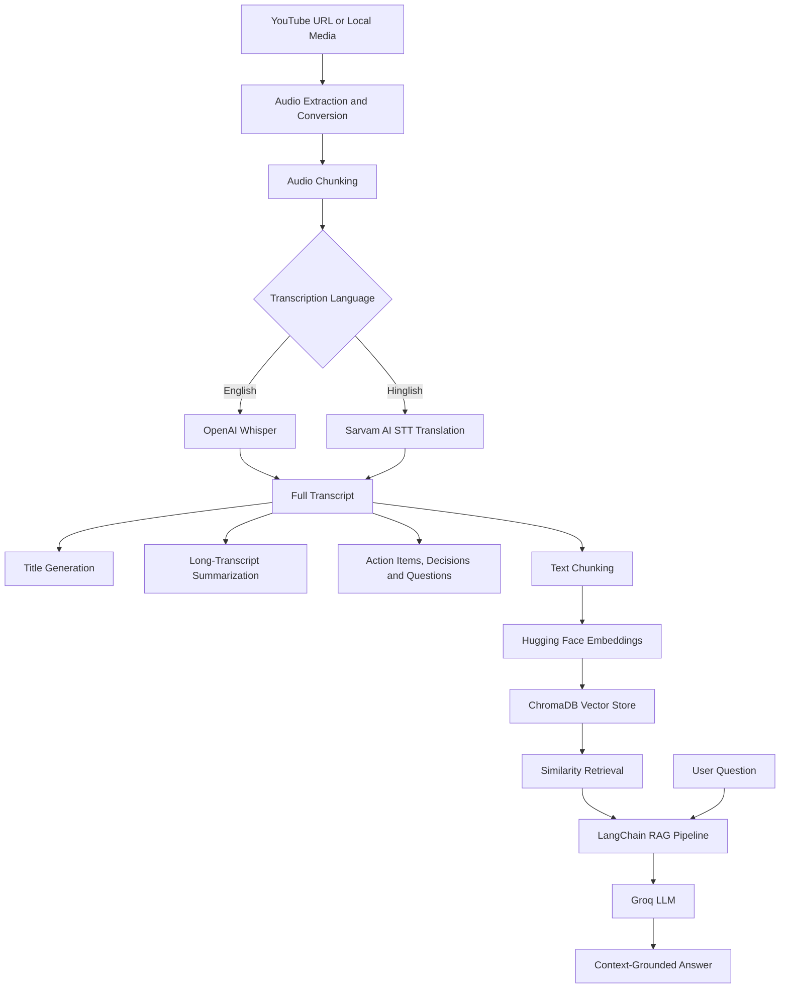

# 🎬 AI Video Assistant RAG

**Turn YouTube videos and local audio/video recordings into searchable knowledge with AI-powered transcription, summarization, structured insights, and Retrieval-Augmented Generation (RAG).**

AI Video Assistant RAG transforms long-form video and audio content into concise, actionable information. It transcribes recordings, generates summaries, extracts action items and key decisions, identifies open questions, and lets users ask questions about the original content through a conversational AI interface.

Built with Python, Streamlit, Whisper, Groq, LangChain, and ChromaDB.

## ✨ Features

* 🎥 **YouTube & Local Media Processing** — Process YouTube URLs or local audio/video files.
* 🎙️ **Speech-to-Text Transcription** — Use OpenAI Whisper for local English transcription.
* 🌐 **Hinglish Transcription** — Use Sarvam AI's speech-to-text translation API to transcribe Hinglish speech into English.
* ✂️ **Audio Chunking** — Split long recordings into manageable segments for processing.
* 📝 **AI-Generated Titles** — Automatically generate concise, descriptive titles from transcripts.
* 📋 **Long-Transcript Summarization** — Summarize transcript sections individually and combine them into a unified summary.
* ✅ **Action Item Extraction** — Identify tasks, responsible owners, and deadlines when mentioned.
* 🔑 **Key Decision Extraction** — Extract important decisions from meetings, lectures, and discussions.
* ❓ **Open Question Detection** — Identify unresolved questions and topics requiring follow-up.
* 🧠 **Retrieval-Augmented Generation (RAG)** — Build a searchable vector store from transcript chunks.
* 💬 **Context-Grounded AI Chat** — Ask natural-language questions and generate answers using relevant transcript passages.
* 🖥️ **Streamlit Interface** — Interact with the application through a web-based UI.
* ⌨️ **CLI Support** — Run the processing pipeline and chat with a transcript from the terminal.

## 🏗️ Architecture



## 🔄 How It Works

1. **Input:** Provide a YouTube URL or the path to a local audio/video file.
2. **Audio preparation:** Download audio when processing a YouTube URL, or convert local media to WAV. Audio is normalized to mono, 16 kHz where applicable, and divided into 10-minute chunks.
3. **Transcription:** Whisper processes English audio locally. For Hinglish, the application uses Sarvam AI's transcription and translation endpoint, splitting audio into shorter segments to respect API duration limits.
4. **Content analysis:** The transcript is used to generate a title, a consolidated summary, action items, key decisions, and open questions.
5. **Knowledge indexing:** The transcript is split into overlapping text chunks and embedded using `all-MiniLM-L6-v2`. ChromaDB stores the resulting vectors.
6. **Question answering:** A LangChain Expression Language (LCEL) pipeline retrieves the four most relevant chunks by similarity and supplies them as context to the Groq-hosted LLM.
7. **Response:** The assistant answers questions using the retrieved transcript context and is instructed to say when the requested information cannot be found.

## 🛠️ Tech Stack

| Component                            | Technology                       |
| ------------------------------------ | -------------------------------- |
| Language                             | Python 3.12+                     |
| User Interface                       | Streamlit                        |
| Speech Recognition                   | OpenAI Whisper                   |
| Hinglish Transcription & Translation | Sarvam AI                        |
| LLM Inference                        | Groq API (`openai/gpt-oss-120b`) |
| LLM Orchestration                    | LangChain and LCEL               |
| Embedding Model                      | Hugging Face `all-MiniLM-L6-v2`  |
| Vector Database                      | ChromaDB                         |
| Audio Download                       | yt-dlp                           |
| Audio Processing                     | pydub and FFmpeg                 |
| Environment Configuration            | python-dotenv                    |
| Dependency Management                | uv / pip                         |

## 📂 Project Structure

```text
AI-Video-Assistant-RAG/
│
├── app.py                         # Streamlit web interface
├── main.py                        # Main processing pipeline and CLI
├── test.py                        # Testing / pipeline experiments
├── pyproject.toml                 # Project configuration and dependencies
├── requirements.txt               # Python dependencies
├── uv.lock                        # Locked dependency versions
├── packages.txt                   # System packages for deployment
├── .python-version                # Python version configuration
├── .env                           # Local secrets (not committed)
│
├── core/
│   ├── transcriber.py             # Whisper and Sarvam transcription
│   ├── summarize.py               # Title generation and summarization
│   ├── extractor.py               # Action items, decisions, questions
│   ├── vector_store.py             # Embeddings, ChromaDB and retrieval
│   └── rag_engine.py              # RAG chain and question answering
│
├── utils/
│   └── audio_processor.py         # Download, conversion and chunking
│
├── downloads/                     # Downloaded / processed audio
└── vector_db/                     # Persistent ChromaDB data
```

*Note: Generated directories may be created at runtime. The project also contains a `src/ai_video_assistant_rag/` package directory.*

## 🚀 Getting Started

### Prerequisites

Before running the application, install:

* Python 3.12 or a compatible newer version
* [FFmpeg](https://ffmpeg.org/download.html), installed and available on your system `PATH`
* [uv](https://docs.astral.sh/uv/) or pip
* A Groq API key
* A Sarvam AI API key if you want to use Hinglish transcription

### 1. Clone the repository

```bash
git clone https://github.com/dipesh-bhattarai/AI-Video-Assistant-RAG.git
cd AI-Video-Assistant-RAG
```

### 2. Create and activate a virtual environment

Using uv:

```bash
uv sync
```

Activate the environment in Windows PowerShell:

```powershell
.venv\Scripts\Activate.ps1
```

On macOS/Linux:

```bash
source .venv/bin/activate
```

Alternatively, use pip:

```bash
python -m venv .venv
```

Activate the environment, then install the dependencies:

```bash
pip install -r requirements.txt
```

### 3. Configure environment variables

Create a `.env` file in the project root:

```env
GROQ_API_KEY=your_groq_api_key
SARVAM_API_KEY=your_sarvam_api_key
WHISPER_MODEL=small
SARVAM_STT_MODEL=saaras:v2.5
```

* `GROQ_API_KEY` — Required for summarization, title generation, information extraction, and RAG responses.
* `SARVAM_API_KEY` — Required when using the Hinglish transcription path.
* `WHISPER_MODEL` — Whisper model name; defaults to `small`.
* `SARVAM_STT_MODEL` — Sarvam transcription model; defaults to `saaras:v2.5`.

Never commit API keys or your `.env` file to GitHub.

### 4. Verify FFmpeg

Make sure FFmpeg is installed and accessible:

```bash
ffmpeg -version
```

FFmpeg is an external system dependency used for audio extraction and conversion. Installing the Python packages alone does not guarantee FFmpeg is available.

### 5. Run the application

Launch the Streamlit interface:

```bash
streamlit run app.py
```

Streamlit will display a local URL in the terminal, typically:

```text
http://localhost:8501
```

Open that URL in your browser.

## 💻 CLI Usage

You can also run the processing pipeline directly:

```bash
python main.py
```

Enter the YouTube URL or local file path when prompted, followed by the transcription language.

Example YouTube input:

```text
https://www.youtube.com/watch?v=VIDEO_ID
```

Example local input on Windows:

```text
C:\Videos\lecture.mp4
```

Select `english` for Whisper transcription or `hinglish` for Sarvam transcription and translation.

After processing, the CLI prints the generated title, summary, action items, key decisions, and open questions. You can then ask follow-up questions about the transcript.

Type `exit`, `quit`, or `q` to end the chat session.

## 🧠 RAG Implementation Details

The question-answering pipeline uses a straightforward retrieval-augmented generation architecture:

* **Chunking:** `RecursiveCharacterTextSplitter` creates transcript chunks of 500 characters with 50 characters of overlap.
* **Embeddings:** `all-MiniLM-L6-v2` converts chunks into vector representations using CPU inference.
* **Vector storage:** ChromaDB stores embeddings in the local `vector_db/` directory.
* **Retrieval:** Similarity search retrieves the top four relevant chunks for each question.
* **Generation:** LangChain LCEL passes the retrieved context and user question to the Groq-hosted `openai/gpt-oss-120b` model.
* **Grounding instructions:** The model is instructed to answer from the provided transcript context and acknowledge when the answer is not present.

The vector store is built from the processed transcript, allowing questions to target the content of a particular recording rather than relying solely on the LLM's general knowledge.

## ⚙️ Configuration Notes

* Whisper runs locally, so transcription speed and memory usage depend on your hardware and selected model.
* The Hinglish transcription path requires network access and a valid Sarvam API key.
* Summarization, extraction, and question answering require access to the Groq API.
* YouTube downloads can fail because of changes in YouTube delivery mechanisms, access restrictions, or media availability.
* Long recordings require additional processing time for conversion, transcription, summarization, and embedding generation.
* The current RAG implementation uses similarity retrieval; it does not yet implement hybrid BM25 retrieval or a dedicated reranking stage.

## 🗺️ Potential Improvements

* [ ] Add automated evaluation for retrieval relevance and answer faithfulness.
* [ ] Improve error handling and retry behavior for failed downloads and API requests.
* [ ] Add transcript timestamps and source references to chat answers.
* [ ] Support persistent chat history across sessions.
* [ ] Add support for additional languages.
* [ ] Add configurable chunk sizes and retrieval parameters.
* [ ] Add tests for the ingestion, transcription, summarization, and retrieval pipelines.
* [ ] Improve deployment configuration and resource efficiency.
* [ ] Add downloadable transcript and analysis reports.

## 🔐 Security

* Keep API keys in environment variables.
* Do not upload private recordings or generated transcripts to public repositories.
* Review the privacy policies of external APIs before submitting sensitive audio.
* Ensure downloaded media and generated vector data are excluded from version control when appropriate.

## 👨‍💻 Author

**Dipesh Bhattarai**

* GitHub: [@dipesh-bhattarai](https://github.com/dipesh-bhattarai)
* Project: [AI-Video-Assistant-RAG](https://github.com/dipesh-bhattarai/AI-Video-Assistant-RAG)

<!-- ## 📄 License

No license is currently specified in this repository. Add a `LICENSE` file if you intend to define the terms under which others can use, modify, or distribute the project. -->
